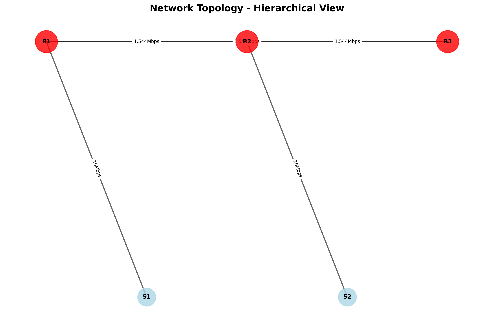

# 🌐 Network Configuration Analyzer & Visualizer

**A Python-based network topology analyzer and visualizer using OSPF, VLANs, and automation.**

# 🌐 Network Configuration Analyzer & Visualizer


**A Python-based network topology analyzer and visualizer using OSPF, VLANs, and automation.**

---

## 📌 Overview

This project presents a **Python-based automation solution** designed to analyze Cisco router and switch configuration files and transform them into clear, structured, and visually interpretable network topologies.

The tool parses raw configuration data to extract critical networking information such as:

* Interface details
* IP addressing
* VLAN assignments
* Routing protocols (OSPF)

It then constructs an accurate representation of the network architecture and generates multiple output formats for analysis and visualization.

## 🚀 Features

* Parses Cisco router and switch configuration files
* Extracts network topology information automatically
* Builds a graph-based topology model
* Generates structured JSON output
* Creates visual network diagram (PNG)
* Produces interactive HTML-based topology view

---

## ⚙️ How It Works

1. Configuration files are read from `sample_configs/`
2. The parser extracts interfaces, IP addresses, VLANs, and OSPF data
3. A graph-based topology is created using NetworkX
4. The system generates:
   - JSON (structured data)
   - PNG (visual diagram)
   - HTML (interactive topology)

## 💡 Use Cases

- Network topology visualization
- Configuration validation
- Learning networking concepts (OSPF, VLANs)
- Assisting network administrators in troubleshooting
  
## 🛠️ Technologies Used

* Python 3
* NetworkX
* Matplotlib
* Cisco Packet Tracer

---

## 🏗️ Network Design / Architecture

* **Routers:** R1, R2, R3
* **Switches:** S1, S2
* **VLANs:** 10 & 20
* **Routing Protocol:** OSPF

---


## 📂 Project Structure

```
.
├── sample_configs/
├── output/
├── config_parser.py
├── topology_builder.py
├── network_visualizer.py
├── main.py
├── requirements.txt
└── README.md
```

---
## ⚙️ How to Use

Follow these steps to run the project locally:

### 1️⃣ Clone the Repository

```bash
https://github.com/mamon404/Network-Topology-Analyzer
cd Network-Topology-Analyzer
```

---

### 2️⃣ Install Dependencies

```bash
pip install -r requirements.txt
```

---

### 3️⃣ Add Configuration Files

Place your Cisco router and switch configuration files inside:

## note: If you have more routers and switches, then go to the main.py file and enter the information of your routers and switches in the Configuration files path.

```
sample_configs/
```

---

### 4️⃣ Run the Project

```bash
python main.py
```

---

### 5️⃣ View Output

After execution, the following files will be generated inside the `output/` folder:

* 🖼️ `network_diagram.png` → Visual topology
* 🌐 `topology.html` → Interactive network view
* 📊 `topology.json` → Structured data

---

### 6️⃣ Open HTML Visualization

Open the file in your browser:

```
output/topology.html
```

---

## ✅ Requirements

* Python 3.x installed
* Basic knowledge of networking (OSPF, VLANs)
* Cisco configuration files as input


## 📸 Network Topology




[Network Topology Report](https://drive.google.com/file/d/1kFfarbtmrr7cAndUP1lHKFrRMfHfU9AU/view?usp=drive_link)
---

## 📂 Sample Configurations

Cisco router and switch configuration files are stored in:

```
sample_configs/
```

These files serve as input for parsing and topology generation.

---

## 🧪 Testing & Results

* ✅ Successful end-to-end connectivity (Ping test)
* ✅ OSPF adjacency established correctly
* ✅ VLAN communication verified

---

## 📄 Documentation

Full project report available at:

```
docs/report.pdf
```

---

## 🎯 Future Improvements

* Integration with real network devices
* Implementation of security features (ACLs, IDS/IPS)
* Extension to cloud and SDN environments

---

## 👨‍💻 Author

**Mamon SK**
Cybersecurity Student | Aspiring SOC Analyst
📧 [mamonsk2ab@gmail.com](mailto:mamonsk2ab@gmail.com)

---

⭐ *"Automating networks, securing systems."*
